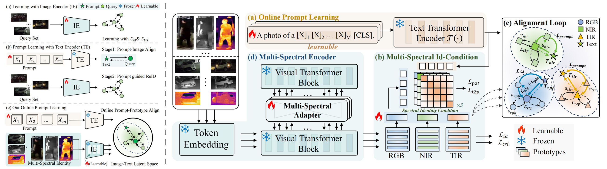
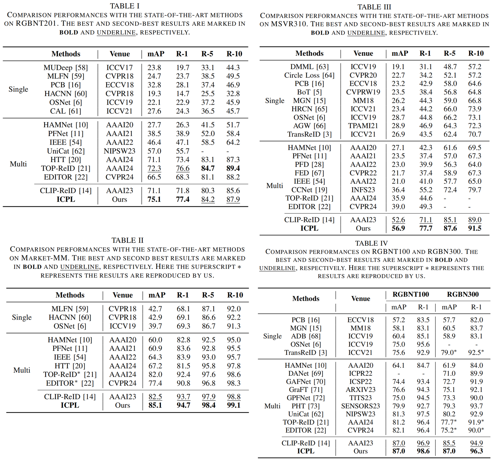

# ICPL-ReID: Identity-Conditional Prompt Learning for Multi-Spectral Object Re-Identification
Official PyTorch implementation of the paper:

**"ICPL-ReID: Identity-Conditional Prompt Learning for Multi-Spectral Object Re-Identification"**  
<!-- Authors: [Shihao Li], [Chenglong Li], [Aihua Zheng], [Jin Tang], [Bin Luo]. -->
Authors: [Shihao Li, Chenglong Li, Aihua Zheng, Jin Tang, Bin Luo].

Accpected by [IEEE Transactions on Multimedia], [2025]  
[[Paper]](https://arxiv.org/pdf/2505.17821) 

---

## 📌 Abstract

 <!-- optional -->

Multi-spectral object re-identification (ReID) brings a new perception perspective for smart city and intelligent transportation applications, effectively addressing challenges from complex illumination and adverse weather. However, complex
modal differences between heterogeneous spectra pose challenges to efficiently utilizing complementary and discrepancy of spectra information. Most existing methods fuse spectral data through intricate modal interaction modules, lacking fine-grained semantic understanding of spectral information (e.g., text descriptions, part masks, and object keypoints). To solve this challenge, we propose a novel Identity-Conditional text Prompt Learning framework (ICPL), which exploits the powerful cross-modal alignment capability of CLIP, to unify different spectral visual features from text semantics. Specifically, we first propose the online prompt learning using learnable text prompt as the
identity-level semantic center to bridge the identity semantics of different spectra in online manner. Then, in lack of concrete
text descriptions, we propose the multi-spectral identity-condition module to use identity prototype as spectral identity condition to constraint prompt learning. Meanwhile, we construct the alignment loop mutually optimizing the learnable text prompt and spectral visual encoder to avoid online prompt learning disrupting the pre-trained text-image alignment distribution.
In addition, to adapt to small-scale multi-spectral data and mitigate style differences between spectra, we propose multi-spectral adapter that employs a low-rank adaption method to learn spectra-specific features. Comprehensive experiments on
5 benchmarks, including RGBNT201, Market-MM, MSVR310, RGBN300, and RGBNT100, demonstrate that the proposed method outperforms the state-of-the-art methods.

 <!-- optional -->

---

## 🛠️ Setup

### 1. Clone the repository

```bash
git clone https://github.com/lsh-ahu/ICPL-ReID.git
cd ICPL-ReID
```

### 2. Create environment
```
conda create -n ICPL-ReID python=3.11.5
conda activate ICPL-ReID
pip install -r requirement.txt
```

### 3. Prepare datasets

Download the datasets, and then unzip them to `./data`:
* RGBNT201: [Google Drive](https://drive.google.com/drive/folders/1EscBadX-wMAT56_It5lXY-S3-b5nK1wH?usp=sharing)
* MSVR310: [Google Drive](https://drive.google.com/file/d/1IxI-fGiluPO_Ies6YjDHeTEuVYhFdYwD/view?usp=drive_link)
* RGBNT100: [Baidu Pan](https://pan.baidu.com/s/1xqqh7N4Lctm3RcUdskG0Ug) (Code: rjin)
* WMVEID863: [Google Drive](https://drive.google.com/file/d/186Ep0YgHY0a8BQ1Z59HP1D2-kZazbH02/view?usp=drive_link)
* Market-MM: [Google Drive](https://drive.google.com/drive/folders/1EscBadX-wMAT56_It5lXY-S3-b5nK1wH)

Organize datasets as:
```
data/
├── RGBNT201/
│   ├── train_171/
│   └── test/
├── MSVR310/
│   ├── bounding_box_test/
│   ├── bounding_box_train/
│   └── query3/
├── RGBNT100/
│   └── rgbir
│      ├── bounding_box_test/
│      ├── bounding_box_train/
│      └── query/
├── WMVEID863/
│   ├── train/
│   ├── test/
│   └── query/
├── Market-1501-RGBNT/
│   ├── train/
│   ├── query/
│   └── gallery/
```

### 🚀 Training & 🧪 Evaluation

```
# RGBNT201 
CUDA_VISIBLE_DEVICES=0 python train.py --config_file configs/Multi_Modal/ICPL/RGBNT201/ICPL.yml
CUDA_VISIBLE_DEVICES=0 python test.py --config_file configs/Multi_Modal/ICPL/RGBNT201/ICPL.yml

# MSVR310
CUDA_VISIBLE_DEVICES=0 python train.py --config_file configs/Multi_Modal/ICPL/MSVR310/ICPL.yml
CUDA_VISIBLE_DEVICES=0 python test.py --config_file configs/Multi_Modal/ICPL/MSVR310/ICPL.yml

# RGBNT100
CUDA_VISIBLE_DEVICES=0 python train.py --config_file configs/Multi_Modal/ICPL/RGBNT100/ICPL.yml
CUDA_VISIBLE_DEVICES=0 python test.py --config_file configs/Multi_Modal/ICPL/RGBNT100/ICPL.yml

```

### 📖 Citation

If you find our work helpful, please consider citing:

```
@article{li2025icpl,
  title={ICPL-ReID: Identity-Conditional Prompt Learning for Multi-Spectral Object Re-Identification},
  author={Li, Shihao and Li, Chenglong and Zheng, Aihua and Tang, Jin and Luo, Bin},
  journal={arXiv preprint arXiv:2505.17821},
  year={2025}
}
```

### 📬 Contact
For questions or clarifications, feel free to contact:

📧 shli0603@foxmail.com
